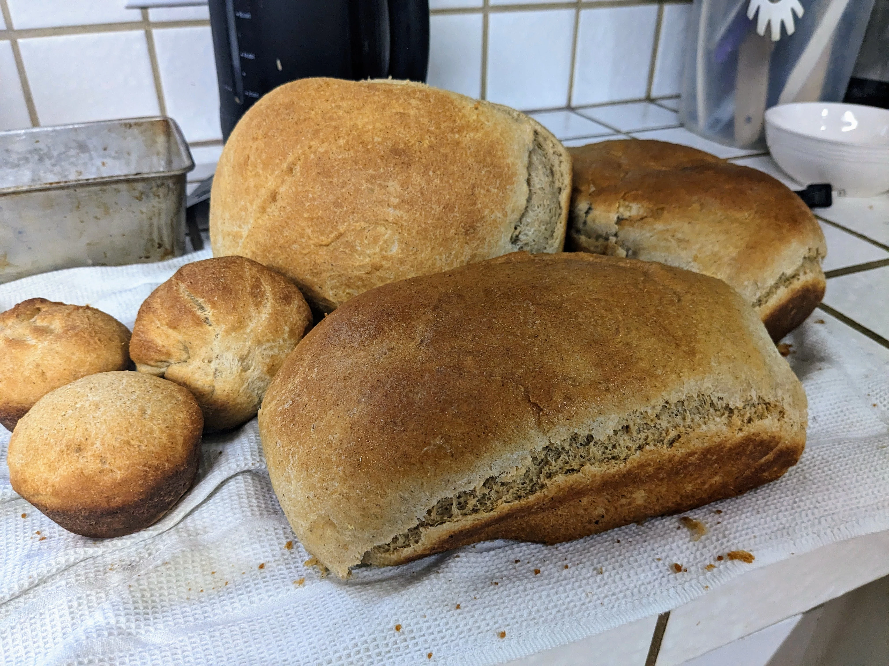

This is the sandwhich loaf I was raised on, and is the primary recipe I continue to
use for day-to-day bread consumption. The bread comes out tender and light, slightly
sweet from the honey, and without the bitter taste that often comes from whole whea
bread thanks to using hard white wheat, rather than hard red wheat (which is often
the base for commercial bread flours).

The recipe usually yields enough dough for 3 loaves of roughly 3lb 10oz (loaf size
will vary depending on the pan you use to bake in), plus a little extra that I will
use to make snack-sized buns in a muffin pan. This recipe also works well for baking
buns - just shape the dough into buns on a sheet pan (air bake pans will help prevent
the bottoms from burning).

I use freshly ground prarie gold (hard white spring wheat) berries for my flour. I
found I could get 2lb bags from Natural Grocers for $1/lb, which is the cheapest
I've been able to find them. My mom used to get wheat in special orders from UNFI,
but I was unable to find Prarie Gold in our regional UNFI catalogue.

Before mixing all of the components, I mix together the flour and water to form an
autolyse, which aids in the formation of gluten and softening the bran in the flour.
This results in slightly reduced kneading times. The autolyse can be let to sit for
one to three hours, the longer the better.

After a few runs where the bottom of my loaf clung to the bottom of the loaf pan,
despite my best effort to thuroughly oil the pan, I switched over to using just
enough parchment paper to cover the bottom of the pan, while still oiling the sides
(you can use a knife or spatula to free the sides if necessary).